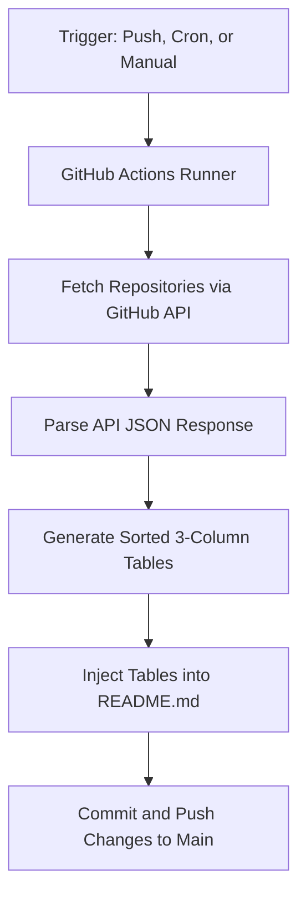

# 📋 Design & Architecture: Automated GitHub Portfolio Sync

This document plans and describes a clean, automated system to dynamically update the [`Project_Architecture/README.md`](file:///c:/Mr-Anonymous-Guy/Project_Architecture/README.md) file with all of the user's public GitHub repositories, their descriptions, and repository URLs.

---

## 🛠️ System Overview

The system consists of a lightweight automation workflow that runs:
1. **Locally**: As a one-command CLI task (leveraging local GitHub CLI authentication or environment variables).
2. **On GitHub Actions**: Automatically on a schedule (cron), on repository pushes, or via manual dispatch (`workflow_dispatch`).



---

## 📂 Component Design

### 1. GitHub API Data Ingestion

To obtain the lists of public repositories, the system queries the GitHub REST API or GraphQL API.

- **Endpoint**: `GET https://api.github.com/users/Mr-Anonymous-Guy/repos?type=public&per_page=100`
- **Fields Needed**:
  - `name` (Project Name)
  - `description` (Detailed summary)
  - `html_url` (Link to the source repository)
  - `archived` (To filter out archived repositories if desired)
  - `topics` (To automatically group repositories by language or category, such as `c`, `cpp`, `java`, `javascript`, `python`)

---

### 2. Synchronization Script Strategy

A synchronization script (implemented in Node.js or Python) will:
1. Load [`Project_Architecture/README.md`](file:///c:/Mr-Anonymous-Guy/Project_Architecture/README.md).
2. Identify placeholders where the project lists are injected. For example:
   ```markdown
   <!-- START_PROJECT_LIST -->
   <!-- END_PROJECT_LIST -->
   ```
3. Fetch public repositories from the GitHub API using the repository token.
4. Categorize repositories using topics, folders, or name matching:
   - Repos matching C focus (e.g., topic `c` or prefix `c-`) -> **01. C Systems**
   - Repos matching C++ focus -> **02. C++ Systems**
   - Repos matching Java focus -> **03. Java Projects**
   - And so on for all 12 defined portfolio categories.
5. Format the projects into markdown tables:
   ```markdown
   | Project | Description | Repo |
   | :--- | :--- | :--- |
   | [Repo Name](https://github.com/Mr-Anonymous-Guy/repo-name) | Repository description here | [Repo Link](https://github.com/Mr-Anonymous-Guy/repo-name) |
   ```
6. Replace the content between the comments and write back to `README.md`.

---

### 3. GitHub Actions Workflow Configuration

To automate this process whenever a change occurs or on a daily basis:

- **Trigger Options**:
  - `schedule`: runs daily (e.g., `0 0 * * *`)
  - `workflow_dispatch`: allows manual execution via a "Run workflow" button on GitHub
  - `repository_dispatch`: triggers externally via webhooks
- **Permissions**:
  - `contents: write`: permissions to commit changes back to the repository
- **Steps**:
  1. **Checkout**: Checks out the `Project_Architecture` repository.
  2. **Install Node/Python**: Sets up the execution environment.
  3. **Execute Sync Script**: Runs the synchronization script, passing the default GitHub token (`secrets.GITHUB_TOKEN`) to authenticate requests.
  4. **Staging & Push**: Checks for changes. If `README.md` is modified, stages, commits, and pushes the updates back to `main`.

---

## 🔒 Security & Optimization Best Practices

1. **Authentication Scopes**: The default `GITHUB_TOKEN` provided inside GitHub Actions is sufficient to read public profile details and has permissions to push to its own repository. No personal access tokens (PAT) or credentials need to be exposed.
2. **Deduplication & Manual Entries**: The parser will preserve custom folders or descriptions by checking if a project has custom metadata defined locally.
3. **API Rate Limiting**: Requests are authenticated, raising the GitHub API rate limit from 60 to 5,000 requests per hour.
